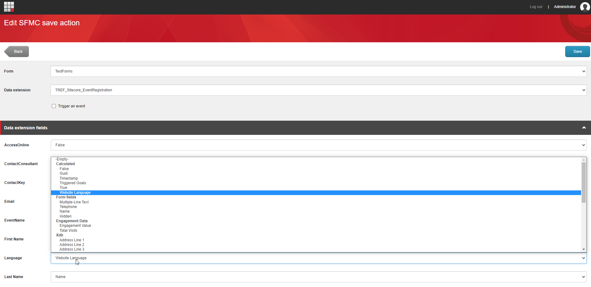
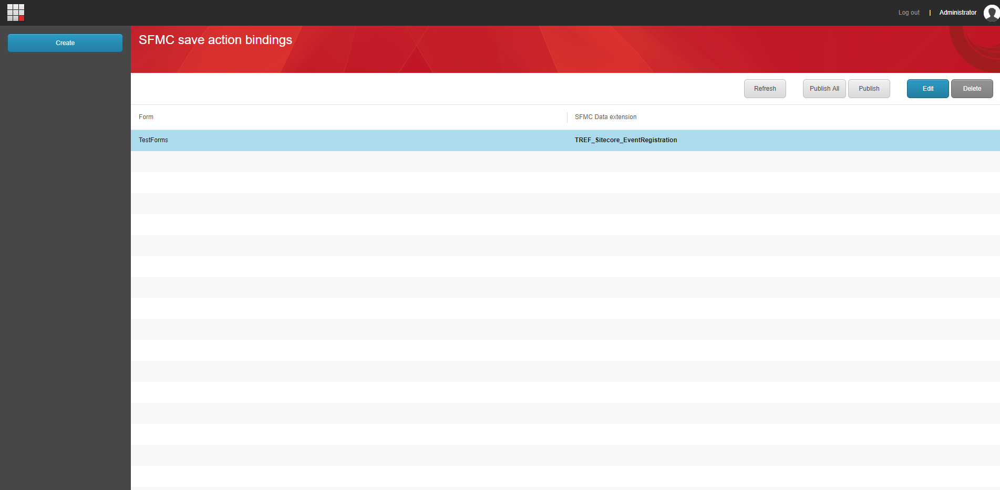
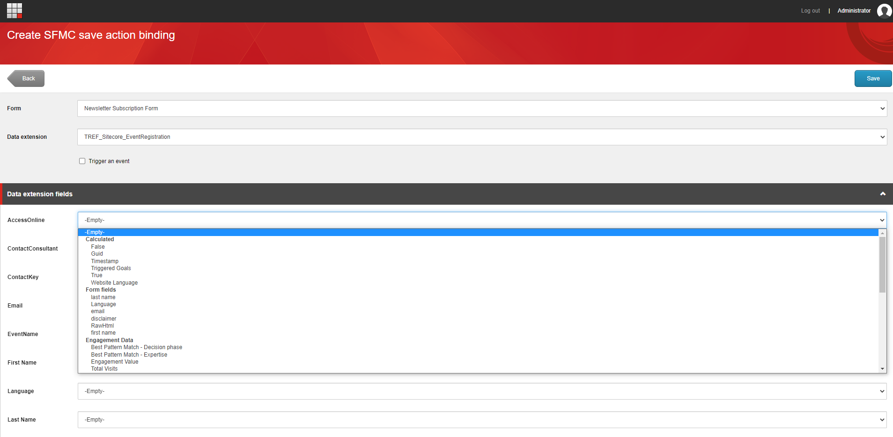

# SFMC Save actions
SFMC Save actions is a module integrating Salesforce Marketing Cloud (SFMC) into Sitecore forms so you can push data from a Sitecore form into SFMC __without developing code__ and with a __intuitive and integrated UI__ for configuration of the field mapping.


## User manual
Before the data arrives in SFMC, the module requires two steps
* A one-time setup _by the developer_
* Creation and configuration of a binding _by the marketeer or content editor_

## Setup
For setting up the module one must download and install the Sitecore module package and publish following items:

> /sitecore/system/Settings/Forms/Submit Actions/Send to SFMC

After that one must configure the salesforce authentication parameters. This is done by adding following code (and replacing the XXX with your auth details) to the configSections part of the web.config:

``` xml
<section name="fuelSDK" type="FuelSDK.FuelSDKConfigurationSection, FuelSDK" />
```
And adding following to the web.config

``` xml
<fuelSDK appSignature="none" clientId="XXX" clientSecret="XXX" useOAuth2Authentication="true" authEndPoint="XXX" restEndPoint="XXX" soapEndPoint="XXX" accountId="XXX"
```

## Creation and configuration of a binding
First you'll need to add the "Send to SFMC" submit action to submit actions of the form you want to send the data to SFMC.

Then, when you open the dashboard application you will be shown a list page:



This page will list all the currently configured bindings. Press the  create button to create a new one.

>Here you can also edit one binding, publish one or all bindings or refresh the list.

When the create button The newly opened page will look like this:



On the top of the page, forms will be listed in the dropdown as well as the existing data extensions from SFMC. As soon as you select a data extension the lower part will be adjusted accordingly to show each data extension column. As soon as a form is selected the dropdowns on each row will be filled with the fields of the selected form. You have the option as well to trigger an event in SFMC as soon as the form is submitted.

If you would prefer to trigger an event, a additional accordion will be shown. There you'll need to fill in the EventDefinitionKey as well as select a field to use for the Contact Key in the event.

Then for each data extension column you'll need to select a field from the dropdown. Fields are grouped:

* __Calculated fields__: values are calculated at submit time e.g. timestamp
* __Form fields__: values are the data the user filled in
* __Engagement data__: values are data from the profile's engagement.
* __Xdb__: values are from fields of your xdb profile

When you save the binding, don't forget to publish it by using the appropriate button.

##  Changelog
| Version        | Release notes |
| ------------- |:-------------:|
| 1.0.0     |  Initial release |
| 1.1.0      | Added Guid calculated field      |
| 1.2.0 | Form labels are wider  |
| 1.2.1 | Adding "SC" prefix to guids      |
| 1.3.0 | Changed Date Time field value. Now returns the value in UTC.<br>Changed calculated GUID field value. Now returns the same value per request for user-defined fields.<br>Changed calculated GUID field value. Remove the "SC" prefix from calculated GUID field values.<br>Added Trigger Event functionality for sending automatic email from Salesforce Marketing Cloud email.<br>Fixed Create or Update Subscriber field value change on the Content Editor page.<br>Fixed master DB access issues on the CD environment. |
| 1.3.1 | Added Empty Value field.<br>Added Publish, Publish All, and Refresh buttons to the Overview List page.<br>Changed pre-selected fields on the detail page when the user creates a new binding.                                                                                                                                                                                                                                                                                                                              |
| 1.4.0 | Changed field label. "Language" label now changed to "Website Language" field label.<br>Added True and False calculated fields.<br>Fixed sending value from form list box fields.<br>Added xDB fields. (Personal Information, Phone Information, Address Information, Email Information, Consent Information).<br>Added Best Pattern Match and Total Engagement fields.                                                                                                                                                    |
| 1.5.0 | Removed the "Create or update Subscriber" option.<br>Fixed existing data extension saving operation.                                                                                                                                                                                                                                                                                                                                                                                                                       |
| 1.6.0 | Added Sitecore Contact Id field under the xDB option group.<br>Enhancement SFMC binding detail page.<br>Changed field labels. "Best Pattern Match" label now changed to "XProfile Best Pattern Match." "Engagement value" label now changed to "XProfile Engagement Value".<br>Enhancement on the SFMC Overview List page. Result of the Publish button or Publish All button notification is on the page.                                                                                                                 |
| 1.7.0 | Added User Total Visits and User Triggered Goals fields.                                                                                                                                                                                                                                                                                                                                                                                                                                                                   |
| 1.8.0 | Enhancement on the Best Pattern Match field. The Content editor is able to bind defined Best Pattern Matches per profile to the form fields.<br>Regrouped the XProfile Engagement Value, User Total Visits, and different Best Pattern Match in one new section called "Engagement Data". Removed the prefix XProfile from the labels.                                                                                                                                                                                     |
| 1.8.1 | Adding xdb enabled check for xdb fields  |
| 1.8.2 | Fix reload issue  |

## Suported versions
SC 9.1+
## Contributors
* [Alex Dhaenens]( https://github.com/AlexDhaenens )
* [Onur Kapçik @onurkapcik]( https://github.com/Poseid10ur)

## Special thanks
* The Reference
* Arnaud Geyskens
